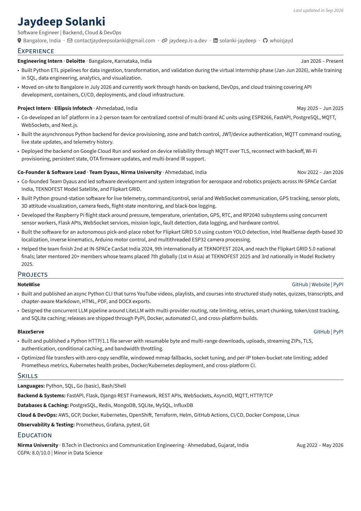

<div align="center">

# A resume that ships.

<p><strong>Write once in YAML. Render everywhere. Deploy automatically.</strong></p>

<p>
  A privacy-conscious, version-controlled resume template powered by
  <a href="https://rendercv.com/">RenderCV</a> and published with GitHub Pages.
</p>

<p>
  <a href="https://whoisjayd.github.io/resume/"></a>
  <a href="https://github.com/whoisjayd/resume/actions/workflows/pages.yml"></a>
  <a href="LICENSE"></a>
</p>

<sub>Readable source · polished PDF, PNG, HTML, Markdown, and Typst outputs · private contact data stays local</sub>

</div>

<p align="center">
  
</p>

This repository is both a live resume and a reusable starting point for a version-controlled CV. The canonical content lives in YAML; a locked `uv` environment and [RenderCV](https://rendercv.com/) produce the outputs; GitHub Actions builds and deploys the sanitized site to GitHub Pages.

## Why this template

- **Source-first:** content, design, locale, and render settings are easy to review and change.
- **Portable:** one source produces HTML, PDF, PNG, Markdown, and Typst.
- **Private by default:** local phone data is opt-in and kept outside the public source.
- **Reproducible:** dependencies are locked with [`uv`](https://docs.astral.sh/uv/).
- **Deployable:** every pull request builds the public site; every `main` push deploys it.
- **Forkable:** replace the sample profile and publish your own resume with the same workflow.

## Live outputs

| Format | Link |
| --- | --- |
| Web resume | [whoisjayd.github.io/resume](https://whoisjayd.github.io/resume/) |
| HTML | [`resume.html`](https://whoisjayd.github.io/resume/resume.html) |
| PDF | [`resume.pdf`](https://whoisjayd.github.io/resume/resume.pdf) |
| PNG preview | [`resume.png`](https://whoisjayd.github.io/resume/resume.png) |
| Markdown | [`resume.md`](https://whoisjayd.github.io/resume/resume.md) |
| Typst source | [`resume.typ`](https://whoisjayd.github.io/resume/resume.typ) |

## Quick start

### Requirements

- Python 3.14 or newer
- [`uv`](https://docs.astral.sh/uv/)
- GNU Make or a compatible implementation

### Build locally

```bash
make setup
make check
make render
```

The normal local build writes phone-free artifacts to the ignored `resume/` directory. Generate the deployable site with:

```bash
make public
```

`make public` always uses the sanitized `cv.yaml`, writes to `public/`, creates the Pages root `index.html`, and runs the privacy gate.

## Make it yours

1. Select **Use this template → Create a new repository** and enable **Settings → Pages → GitHub Actions**.
2. Replace the profile, experience, projects, skills, and education in `cv.yaml`.
3. Tune typography, colors, spacing, and layout in `design.yaml`.
4. Adjust display text in `locale.yaml` or render behavior in `settings.yaml`.
5. Run `make public` and review the rendered files.
6. Push to `main`; GitHub Actions publishes the result to Pages.

The first Pages deployment may require selecting **GitHub Actions** as the Pages source in repository settings. The workflow itself is defined in [`.github/workflows/pages.yml`](.github/workflows/pages.yml).

## Privacy model

Public content belongs in `cv.yaml`. Private local contact data belongs in an ignored `.env` file:

```bash
copy .env.example .env
# Set RESUME_PHONE in .env, then:
make private
```

`make private` creates a temporary phone-inclusive source and renders only to ignored `resume/`. It does not modify `cv.yaml`. `make public` rejects phone keys and phone or telephone markers in public files before publication.

Never commit `.env`, private contact data, or generated output that contains it. See [`SECURITY.md`](SECURITY.md) for reporting an accidental exposure.

## Command reference

| Command | Purpose |
| --- | --- |
| `make setup` | Synchronize the locked Python environment |
| `make render` | Render all local phone-free formats into `resume/` |
| `make private` | Render local outputs with optional `.env` phone data |
| `make public` | Render sanitized deployment files into `public/` |
| `make watch` | Re-render while editing YAML sources |
| `make pdf` | Generate only the local PDF |
| `make preview` | Generate only local PNG previews |
| `make check` | Validate sources with a complete quiet render |
| `make rebuild` | Clean and regenerate local outputs |
| `make doctor` | Display tool versions and active configuration |
| `make clean` | Remove generated files from the selected output directory |

Run `make help` for the grouped command reference. Variables can be overridden:

```bash
make render OUTPUT_DIR=build
make render CV=alternate-cv.yaml
```

## Repository layout

```text
cv.yaml                       # canonical sanitized resume content
design.yaml                   # RenderCV theme and visual system
locale.yaml                   # locale and display text catalog
settings.yaml                 # render settings
scripts/build_resume.py       # local private/public-aware renderer
scripts/check_public.py       # deterministic privacy gate
Makefile                      # setup, render, validation, and cleanup commands
public/                       # tracked sanitized Pages artifacts
resume/                       # ignored local render artifacts
.github/workflows/pages.yml   # CI/CD source of truth
```

Generated files in `public/` are intentionally tracked so the repository has an immediately browsable Pages artifact. Do not hand-edit generated files; regenerate them from the YAML sources.

## Contributing

Read [`CONTRIBUTING.md`](CONTRIBUTING.md) before opening a pull request. Pull requests build and validate the public output without deploying. Changes to the source, design, build, or workflow should include the relevant validation command and a privacy review.

## License

This project is licensed under the [MIT License](LICENSE). You may use, modify, and redistribute the template under its terms. Replace the sample resume content and personal details before publishing your own version.
